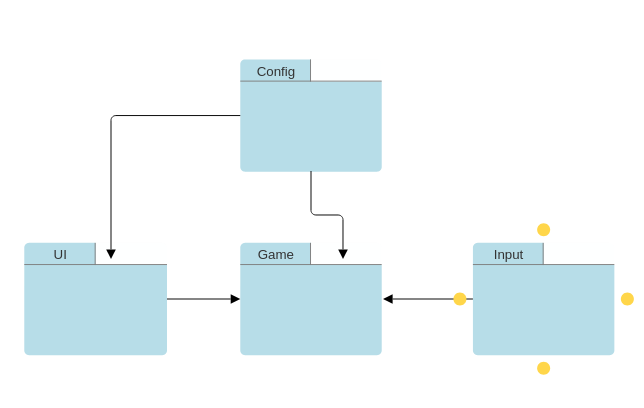

Sovellus koostuu neljästä kansiosta, joiden sisällä on sovelluksen logiikkaa. `UI` kansio sisältää käyttöliittymään käytettäviä apuluokkia, kuten `button.py`, `shapes.py` ja `text.py`. Näiden avulla voidaan helpottaa ja selventää käyttöliittymän rakentamista. Sovelluksen päälogiikka sijaitsee `Game` kansiossa, joka huolehtii kaikesta sovelluksen päätoiminnasta. `Input` kansion tiedostoa `one_press_input.py` käytetään yksittäisten hiirenpainallusten havainnollistamiseen. Viimeiseksi on `Config` kansio, jossa säilötään sovelluksen vakiomuuttujia. Tämän avulla selvennetään koodin selkeyttä ja annetaan helppo pääsy tarvittaviin vakiomuuttujiin.

