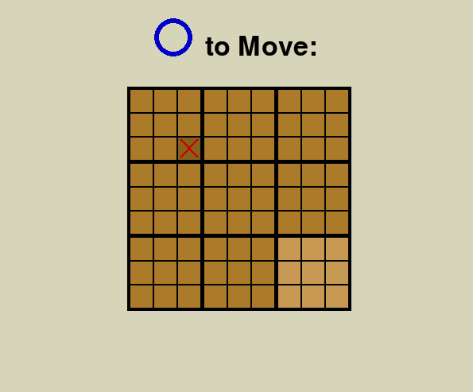

# Käyttöohje

Kopio projektin viimeisin [versio](https://github.com/Wirebin/ot-harjoitustyo/releases) itsellesi valitsemalla lähdekoodin sivulta.

## Ohjelman käynnistäminen

Ennen kuin voit käynnistää ohjelman, tee seuraavat asiat:

Mene projektikansion sisälle ja suorita seuraava komento.
```bash
poetry install --no-root
```

Tämän jälkeen voit käynnistää sovelluksen seuraavalla komennolla.
```bash
poetry run invoke start
```

## Ohjelman käyttö

Ohjelma avautuu päävalikkonäkymään, josta voi joko aloittaa pelin, tai poistua.


Pelissä pelaajat laittavat vuorotellen oman pelinappulan laudalle, X aloittaa. Seuraavan pelaajan pitää aina pelata sille laudanosalle, joka vastaa edellisen pelaajan asettamaa kohtaa.


Kun pelaaja on laittanut oman pelinappulan laudalle, joutuu seuraava pelaaja laittamaan omansa korostetulle laudanosalle.



Jos pelaaja laittaa nappulan siten, että seuraavan pelaajan pitäisi pelata laudalla jonka peli on jo päättynyt, saa tämä pelaaja pelata mihin tahansa vapaaseen ruutuun.


Pelin lopussa kerrotaan kuka voitti ja voi aloittaa pelin uudestaan painamalla 'Restart' nappulaa.


